# Laravel Sample Web

## Laravel 5.7

- Single Table Order

```
Schema::create('orders', function (Blueprint $table) {
Schema::create('orders', function (Blueprint $table) {
    $table->increments('id')->index();
    $table->integer('user_id');
    $table->string('order_no')->unique();
    $table->string('product_name')->default('-');
    $table->string('address')->default('-');
    $table->string('shipping_code')->default('-');
    $table->string('mobile_number')->default('-');
    $table->string('price')->default('-');
    $table->integer('product_type'); //1 is prepaid ------- 0 is product
    // $table->morphs('product'); //if use polymorphism
    $table->integer('paidstatus')->default(0); //1 is paid  //2 fail //3 is cancel
    $table->timestamp('paid_at')->nullable();
    $table->timestamps();
});
``` 
----------
- I use Topup Balance payment with a 90% chance of success at 9AM-5PM and 40% 
otherwise (thi is not a success rate algorithm, but this is a probability algorithm)
```
public function successrate($time) {  
    $result = mt_rand(0, 100);
    if($time>=9 && $time<=17){
        if($result<=40)
            return 1;
        else
            return 2;
    }else{
        if($result<=40)
            return 1;
        else
            return 2;
    }
    return 1;
}
```
----------
- I use Laravel Queue Job and  Scheduling Job function to cancel an order if the order is not paid after 5 minutes
```
class CancelJob implements ShouldQueue
{
    use Dispatchable, InteractsWithQueue, Queueable, SerializesModels;
    private $data;
    public function __construct($data)
    {
        $this->data = $data;
    }
    public function handle()
    {
        Order::where('order_no', $this->data )->where('paidstatus',0)->update(['paidstatus'=> 3 ]);
    }
}
```
```
CancelJob::dispatch($data[0])->delay(now()->addMinutes(5));
```
----------

## Preview

<kbd>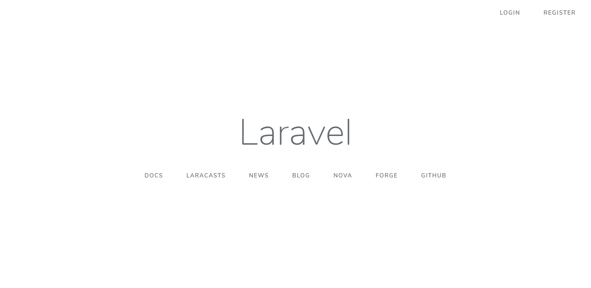</kbd>

<kbd>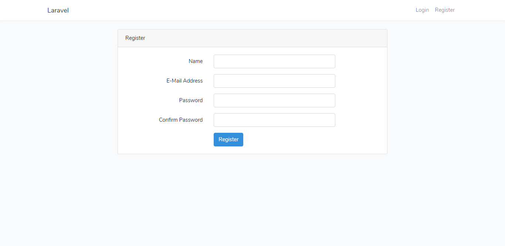</kbd>

<kbd>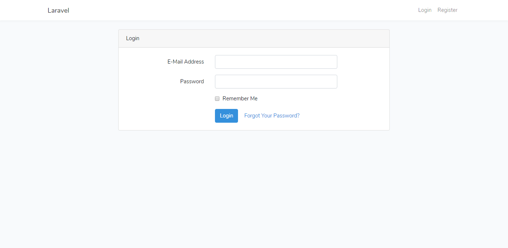</kbd>

<kbd>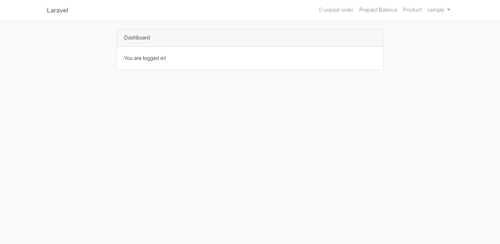</kbd>

<kbd>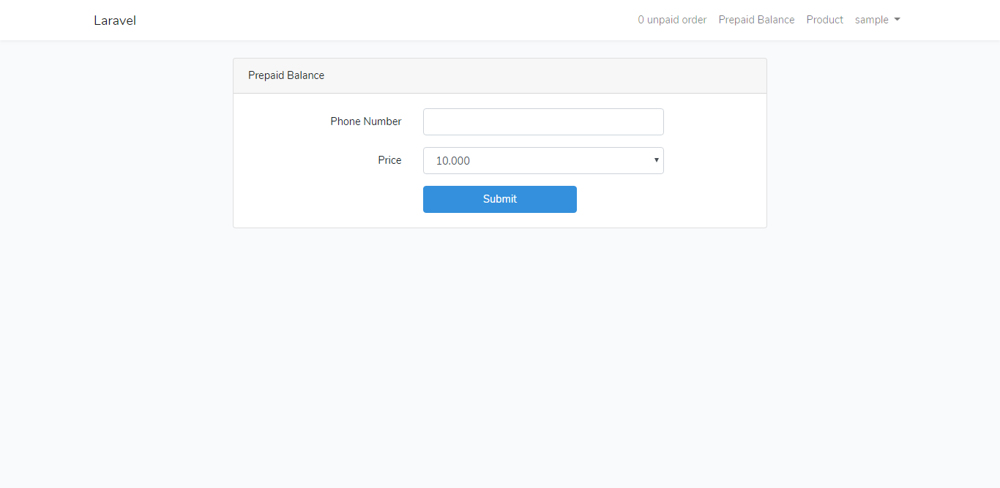</kbd>

<kbd>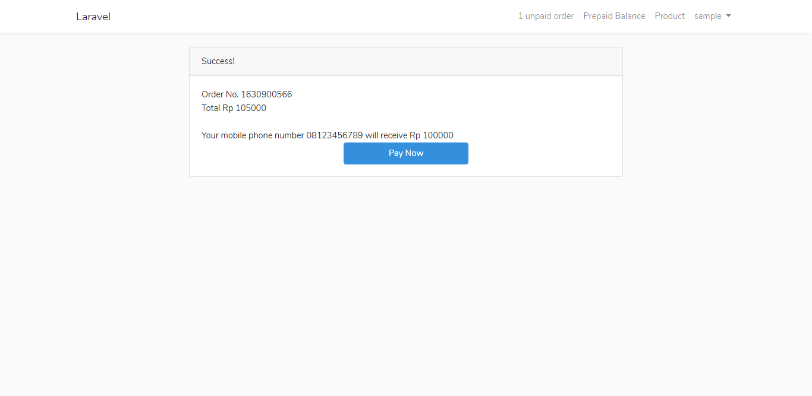</kbd>

<kbd>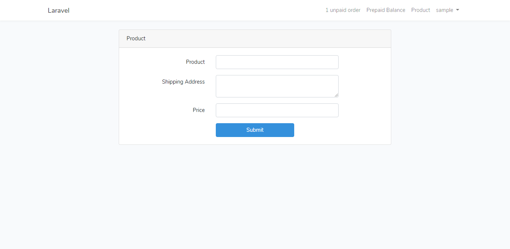</kbd>

<kbd></kbd>

<kbd>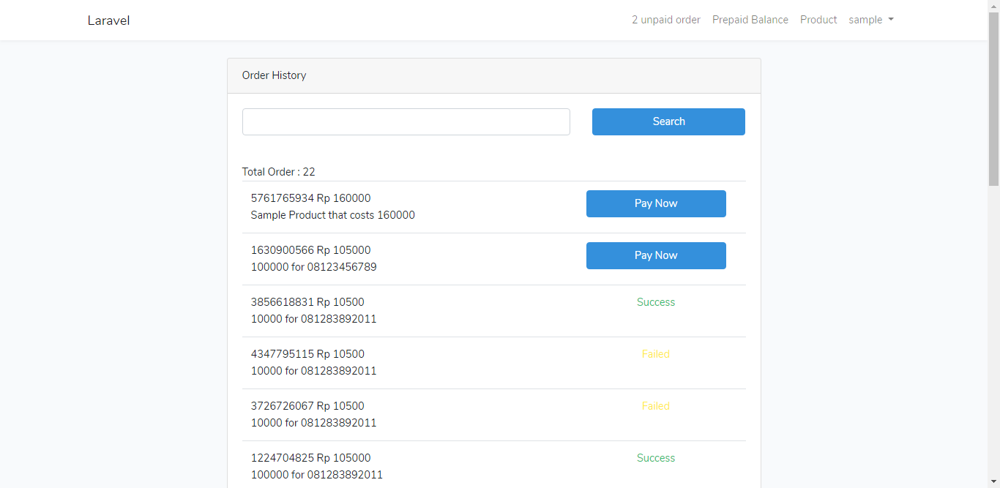</kbd>

<kbd>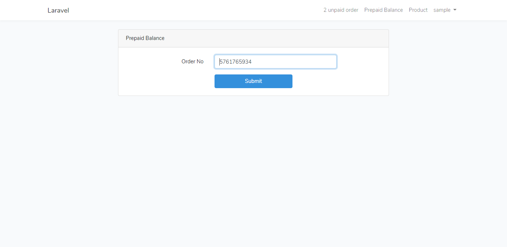</kbd>

<kbd>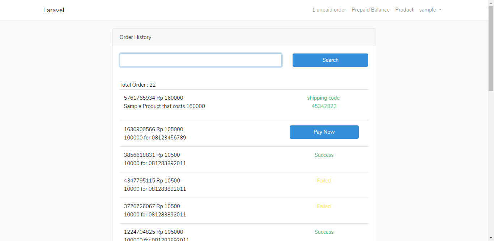</kbd>

<kbd>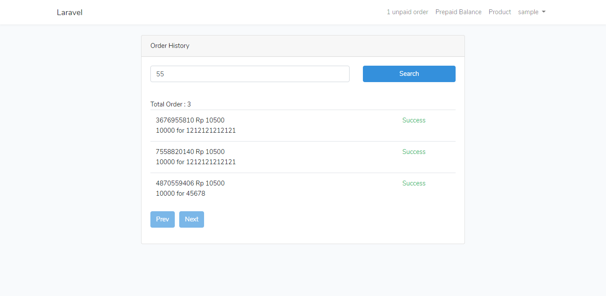</kbd>