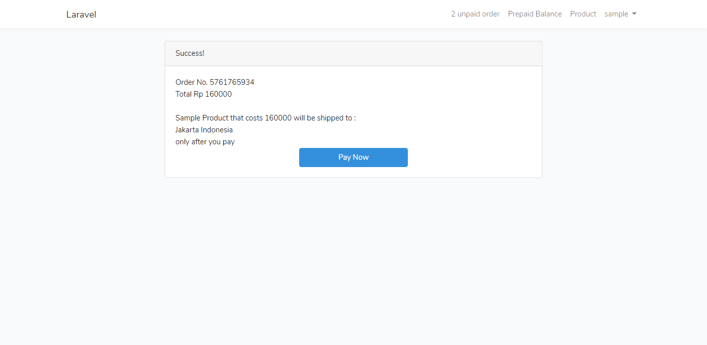

# Laravel Sample Web (Dev Branch)

## Laravel 5.7

- Use Three Table with Morph Relation
  * Product Table to store product detail
  * Prepaid Table to store prepaid detail
  * Order Table to store order detail
```
    products
        id
        product_name
        shipping_address
    
    prepaids
        id
        mobile_number
        value

    orders
        id
        user_id
        order_no
        total_price
        shiiping_code
        paidstatus
        orderable_id
        orderable_type
``` 
----------
- I use Topup Balance payment with a 90% chance of success at 9AM-5PM and 40% 
otherwise (thi is not a success rate algorithm, but this is a probability algorithm)
```
public function successchance($time) {  
    $result = mt_rand(0, 100);
    if($time>=9 && $time<=17){
        if($result<=90)
            return 1;
        else
            return 2;
    }else{
        if($result<=40)
            return 1;
        else
            return 2;
    }
    return 1;
}
```
----------
- I use Laravel Queue Job and  Scheduling Job function to cancel an order if the order is not paid after 5 minutes
```
class CancelJob implements ShouldQueue
{
    use Dispatchable, InteractsWithQueue, Queueable, SerializesModels;
    private $data;
    public function __construct($data)
    {
        $this->data = $data;
    }
    public function handle()
    {
        Order::where('order_no', $this->data )->where('paidstatus',0)->update(['paidstatus'=> 3 ]);
    }
}
```
```
CancelJob::dispatch($data[0])->delay(now()->addMinutes(5));
```
----------

## Preview

<kbd></kbd>

<kbd></kbd>

<kbd></kbd>

<kbd></kbd>

<kbd></kbd>

<kbd></kbd>

<kbd></kbd>

<kbd></kbd>

<kbd></kbd>

<kbd></kbd>

<kbd></kbd>

<kbd></kbd>